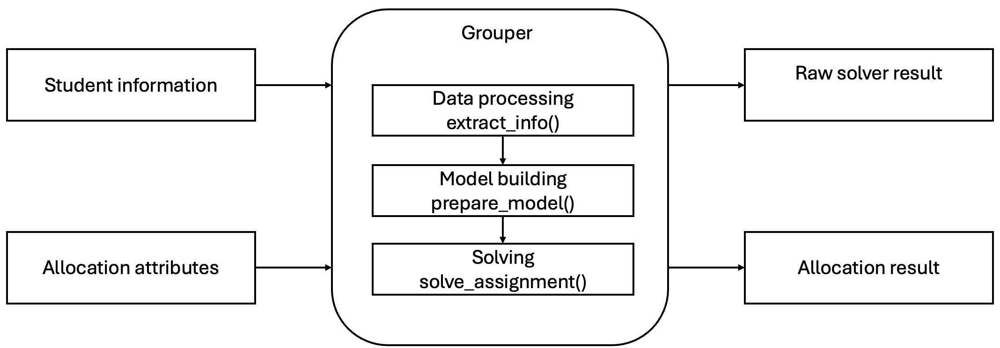
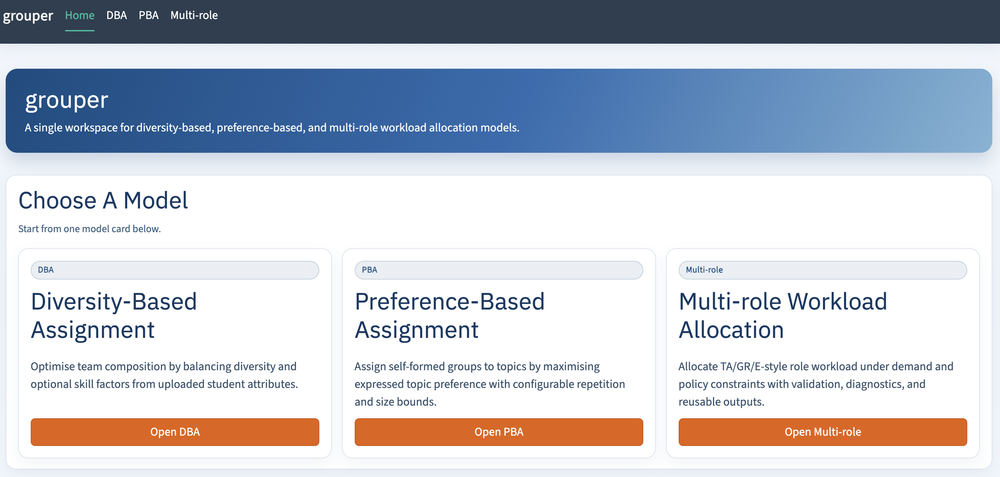
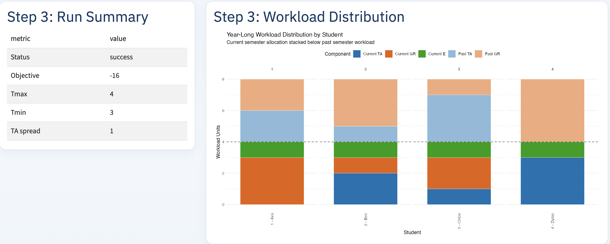

```{r setup, include=FALSE}
knitr::opts_chunk$set(echo = TRUE, warning = FALSE, message = FALSE, fig.align = "center")

required_pkgs <- c(
  "grouper", "ompr", "ompr.roi", "ROI.plugin.glpk", "dplyr", "ggplot2"
)

for (pkg in required_pkgs) {
  if (!requireNamespace(pkg, quietly = TRUE)) {
    stop("Package not installed: ", pkg)
  }
}

suppressPackageStartupMessages({
  library(grouper)
  library(ompr)
  library(ompr.roi)
  library(ROI.plugin.glpk)
  library(dplyr)
  library(ggplot2)
})
```

# Introduction

Allocation problems are a recurring feature of higher education. Instructors and
administrators routinely need to assign students to groups, topics, supervisors,
teaching duties, or other limited resources while balancing preferences,
capacity, fairness, and institutional rules. These decisions often involve
several competing objectives. For example, a course may need diverse project
groups, a program may need to match self-formed groups to topic slots, and a
department may need to distribute teaching or support duties fairly across
people.

In many cases, the allocation policy is clear in principle but difficult to
operationalize. Manual allocation can be time-consuming,
difficult to reproduce, and hard to audit when multiple constraints and policy
goals interact.

The `grouper` package provides a high-level R workflow for optimization-based
allocation in higher education. It currently supports three policy-aware workflows.
These address diversity-based assignment of students to groups and topics,
preference-based assignment of self-formed groups to topic slots, and multi-role
workload allocation.

The contribution of `grouper` is both mathematical and computational. Mathematically,
it encodes recurring allocation priorities such as diversity, preference satisfaction,
capacity control, workload fairness, and priority-aware assignment as explicit
objectives and constraints. Computationally, it exposes these models through a
common R workflow in which users prepare structured data, specify policy parameters,
solve the model through existing R optimization infrastructure, and inspect allocation
results. This design allows users to adapt allocation rules to different courses,
cohorts, departments, or workload settings without rewriting the underlying model
code, making the allocation process more reproducible and transparent than ad hoc
manual assignment.

This paper introduces the mathematical models, implementation, and main
workflows of `grouper`. The next section reviews related work, including
general-purpose R optimization tools and existing higher-education allocation
approaches. We then present the three allocation models, describe how the package
implements them, and use the multi-role workload workflow as the detailed
reproducible demonstration on departmental planning data.

## Related work

Optimization-based allocation has a long history in higher-education planning.
Student-project allocation, group formation, and workload distribution can often
be expressed as mathematical programming problems in which assignment decisions
are represented by binary or integer variables and institutional rules are
encoded as constraints. Prior work has used integer programming approaches to
assign students to projects or topics while accounting for preferences,
capacities, and other institutional constraints
[@anwar2003student; @meyer2009optassign; @ramotsisi2022optimization].

In R, users can access a rich ecosystem of general-purpose optimization tools.
Packages such as `ompr` provide algebraic modeling interfaces for mixed-integer
programming [@R-ompr], while `ROI` provides a common interface to multiple
solver plugins [@R-ROI; @R-ompr-roi].

Solver backends such as `Gurobi`, `GLPK`, and `HiGHS` can then be used to solve the
resulting optimization problems [@gurobi_manual; @glpk_manual; @highs_manual].
These tools are powerful and flexible, but they operate at a relatively low
level of abstraction. Users must still define the decision variables,
constraints, objective functions, data transformations, and post-processing
steps for each allocation problem.

Several tools are closer to higher-education assignment. Student-project allocation
has been studied through integer programming, and web-based or standalone
implementations exist for specific versions of the problem
[@anwar2003student; @meyer2009optassign]. On CRAN, `golfr` provides classroom
group assignment functionality with a focus on minimizing repeated pairings
across multiple rounds [@R-golfr]. These tools address important subproblems,
but they are generally designed around a single assignment setting or
algorithmic goal.

`grouper` differs from these approaches by providing a higher-level package
interface for multiple higher-education allocation workflows. The package does
not replace lower-level optimization software; instead, it packages recurring
models into documented workflows that combine structured input preparation,
configurable policy parameters, mixed-integer model construction, solver
execution, and interpretable output generation. To our knowledge, no existing R
package provides a comparable orchestration layer for diversity-based student
grouping, preference-based topic allocation, and multi-role workload allocation
within one extensible framework.

# Mathematical allocation models

Each `grouper` workflow is formulated as an integer or mixed-integer program.
The objective describes the allocation goal, while the constraints define which
allocations are feasible.

## Diversity-based assignment

### Purpose and inputs

Consider \(N\) students arranged into \(G\) self-formed groups. Each group is
assigned to one of \(T\) topics, and topic \(t\) may have \(R_t\) repetitions.
The model is applicable to tutorial sections, lab teams, interdisciplinary
discussion groups, and capstone teams where instructors want heterogeneous
final groups.

The user supplies the student data, the self-formed-group column, demographic
information or a dissimilarity matrix, and optionally a numeric skill measure.
The extractor constructs \(m_{ig}\), which equals one when student \(i\) belongs
to self-formed group \(g\), the pairwise dissimilarity values \(d_{ij}\), and
the optional skill values \(s_i\).

### Objective

$$
\max \quad w_1 \left(
\sum_{i=1}^{N-1}\sum_{j=i+1}^{N}\sum_{t=1}^{T}
\sum_{r=1}^{R_t}z_{ijtr}d_{ij}\right)
+w_2(s_{\min}-s_{\max}).
$$

Here \(z_{ijtr}\) indicates whether students \(i\) and \(j\) are assigned to
the same repetition \(r\) of topic \(t\). The first term maximizes pairwise
dissimilarity within the final groups. The second minimizes the difference
between their maximum and minimum total skill. The non-negative weights \(w_1\)
and \(w_2\) determine the relative priority of the two terms and are normally
chosen to sum to one. If skill is not supplied, the second term is omitted.

### Key constraints

Let

$$
x_{gtr}=
\begin{cases}
1,&\text{if group \(g\) is assigned to repetition \(r\) of topic \(t\)},\\
0,&\text{otherwise.}
\end{cases}
$$

Each self-formed group must be assigned exactly once:

$$
\sum_{t=1}^{T}\sum_{r=1}^{R_t}x_{gtr}=1,\quad \forall g. \tag{1}
$$

This equality preserves every self-formed group as a unit. It rules out both
leaving a group unassigned and assigning the same group to multiple
topic-repetition combinations.

The binary variable \(z_{ijtr}\) records whether students \(i\) and \(j\) are
both assigned to the topic-repetition combination:

$$
\begin{aligned}
z_{ijtr}&\leq\sum_{g=1}^{G}m_{ig}x_{gtr},\\
z_{ijtr}&\leq\sum_{g=1}^{G}m_{jg}x_{gtr},\\
z_{ijtr}&\geq\sum_{g=1}^{G}m_{ig}x_{gtr}
             +\sum_{g=1}^{G}m_{jg}x_{gtr}-1,
\end{aligned}
\quad \forall i<j,t,r. \tag{2}
$$

The first two inequalities prevent \(z_{ijtr}\) from being one unless both
students are in the slot. The third forces it to one when both are present.
Consequently, \(d_{ij}\) contributes to the objective exactly when the student
pair appears in the same final group.

Let \(a_{tr}=1\) when repetition \(r\) of topic \(t\) is active. The following
constraints link activation to assignment and bound the number of repetitions:

$$
\begin{aligned}
a_{tr}&\geq x_{gtr},&&\quad \forall g,t,r,\\
a_{tr}&\leq\sum_{g=1}^{G}x_{gtr},&&\quad \forall t,r,\\
\sum_{r=1}^{R_t}a_{tr}&\geq r_{\min},&&\quad \forall t,\\
\sum_{r=1}^{R_t}a_{tr}&\leq r_{\max},&&\quad \forall t.
\end{aligned} \tag{3}
$$

The first two conditions make \(a_{tr}\) an indicator for whether the slot is
used. The final two then count the used repetitions of each topic and keep that
count between the instructor-specified limits \(r_{\min}\) and \(r_{\max}\).

The number of students in each active topic-repetition combination is bounded:

$$
\begin{aligned}
\sum_{i=1}^{N}\sum_{g=1}^{G}m_{ig}x_{gtr}
&\geq a_{tr}n_{tr}^{\min},\\
\sum_{i=1}^{N}\sum_{g=1}^{G}m_{ig}x_{gtr}
&\leq a_{tr}n_{tr}^{\max},
\end{aligned}
\quad \forall t,r. \tag{4}
$$

Multiplication by \(a_{tr}\) switches the bounds off for an inactive slot. For
an active slot, the total number of students contributed by its assigned
self-formed groups must lie between \(n_{tr}^{\min}\) and \(n_{tr}^{\max}\).

When skill balancing is used, \(s_{\min}\) and \(s_{\max}\) bound the total
skill assigned to each active topic-repetition combination:

$$
\begin{aligned}
\sum_{i=1}^{N}\sum_{g=1}^{G}m_{ig}x_{gtr}s_i&\geq s_{\min},\\
\sum_{i=1}^{N}\sum_{g=1}^{G}m_{ig}x_{gtr}s_i&\leq s_{\max},
\end{aligned}
\quad \forall t,r\text{ with }a_{tr}=1. \tag{5}
$$

These bounds make \(s_{\min}\) and \(s_{\max}\) the lowest and highest total
skill among active slots. Maximizing \(s_{\min}-s_{\max}\) therefore minimizes
the skill spread. Inactive candidate repetitions are excluded from this
comparison.

| parameter | if increased | trade-off |
|---|---|---|
| `w1` | places greater relative emphasis on pairwise diversity | may place less emphasis on skill balance |
| `w2` | places greater relative emphasis on reducing skill differences | may accept lower pairwise diversity |
| `nmin` | requires more students in each active topic-repetition combination | tightens feasibility |
| `nmax` | permits more students in each topic-repetition combination | increases flexibility but may permit less even group sizes |
| `rmin` | requires more active repetitions of every topic | tightens feasibility and spreads students across more repetitions |
| `rmax` | permits more active repetitions of every topic | increases flexibility but may fragment the cohort |
| `n_topics` | requires assignments across more topics when `rmin` is positive | increases model size and may tighten feasibility |
| `R` (\(R_t\)) | provides more candidate repetitions | increases model size and only adds flexibility when repetition bounds permit their use |

Table: Parameter effect guide for the diversity-based assignment model
(directional, holding other settings fixed).

## Preference-based assignment

### Purpose and inputs

Unlike the diversity-based model, which assigns groups according to student
attributes and the desired composition of the final slots, this model is used
when groups have expressed preferences over the available destinations. The
self-formed groups remain intact, and the main decision is where each group
should be placed rather than which student profiles should be brought together.

Consider \(N\) students arranged into \(G\) self-formed groups. Each group is
assigned to a topic \(t\) from \(T\) base topics. A topic may contain \(B\)
subgroups, giving \(BT\) topic-subgroup combinations, and each combination may
be repeated \(R_t\) times. This setting arises in the allocation of project
topics, case studies, supervisors, lab rotations, presentation themes, and
tutorial or project streams.

The user supplies the student data, self-formed-group column, and preference
matrix. The extractor obtains \(m_{ig}\), group sizes \(n_g\), and preference
scores \(p_{tg}\), where higher values indicate stronger preferences.

### Objective

$$
\max\sum_{g=1}^{G}\sum_{t=1}^{BT}\sum_{r=1}^{R_t}
x_{gtr}n_gp_{tg}.
$$

Here \(x_{gtr}=1\) when group \(g\) is assigned to repetition \(r\) of
topic-subgroup combination \(t\). Multiplication by \(n_g\) means that an
assignment affecting a larger group contributes more to total student-level
preference satisfaction.

### Key constraints

Every self-formed group must be assigned exactly once:

$$
\sum_{t=1}^{BT}\sum_{r=1}^{R_t}x_{gtr}=1,\quad \forall g. \tag{6}
$$

As in the diversity model, this equality keeps each self-formed group intact and
assigns it to one, and only one, topic-subgroup repetition.

Let \(a_{tr}=1\) when repetition \(r\) of topic-subgroup combination \(t\) is
active. Activation is linked to the assignments by

$$
\begin{aligned}
a_{tr}&\geq x_{gtr},&&\quad \forall g,t,r,\\
a_{tr}&\leq\sum_{g=1}^{G}x_{gtr},&&\quad \forall t,r.
\end{aligned} \tag{7}
$$

These conditions ensure that a repetition is marked active exactly when at
least one self-formed group is assigned to it. This indicator is then used in
the repetition and capacity constraints below.

The number of repetitions of each base topic is bounded by

$$
\begin{aligned}
\sum_{r=1}^{R_t}a_{tr}&\geq r_{\min},\\
\sum_{r=1}^{R_t}a_{tr}&\leq r_{\max},
\end{aligned}
\quad \forall t\in\{1,\ldots,T\}. \tag{8}
$$

The constraints are written for the first subgroup of each base topic. They
require every offered topic to have between \(r_{\min}\) and \(r_{\max}\)
active repetitions.

The number of active repetitions is kept equal across subgroups belonging to
the same base topic:

$$
\sum_{r=1}^{R_t}a_{tr}
=\sum_{r=1}^{R_t}a_{(bT+t)r},
\quad \forall t\in\{1,\ldots,T\},\quad b=1,\ldots,B-1. \tag{9}
$$

With topic-subgroup columns ordered as \(T_1S_1,\ldots,T_TS_1,T_1S_2,\ldots\),
this equality gives every subgroup of a base topic the same number of active
repetitions. The limits in (8) therefore propagate to all \(B\) subgroups.

Every active topic-subgroup repetition must satisfy its student-capacity bounds:

$$
\begin{aligned}
\sum_{i=1}^{N}\sum_{g=1}^{G}m_{ig}x_{gtr}
&\geq a_{tr}n_{tr}^{\min},\\
\sum_{i=1}^{N}\sum_{g=1}^{G}m_{ig}x_{gtr}
&\leq a_{tr}n_{tr}^{\max},
\end{aligned}
\quad \forall t\in\{1,\ldots,BT\},r. \tag{10}
$$

The membership matrix converts group-level assignments into student counts.
Thus, every active repetition must contain at least \(n_{tr}^{\min}\) and at
most \(n_{tr}^{\max}\) students, while inactive repetitions remain empty.

| parameter | if increased | trade-off |
|---|---|---|
| `n_topics` | provides more base topics, each subject to the repetition rules | increases model size and may tighten feasibility |
| `B` | adds more subgroups to every topic | permits finer organization but adds balancing requirements |
| `R` (\(R_t\)) | provides more candidate repetitions | increases model size and only adds flexibility when `rmax` permits |
| `nmin` | requires more students in each active repetition | prevents underfilled groups but tightens feasibility |
| `nmax` | permits more students in each repetition | increases flexibility but may permit crowded groups |
| `rmin` | requires more repetitions of every topic and corresponding subgroup | tightens feasibility and may reduce achievable preference scores |
| `rmax` | permits more repetitions | increases flexibility but may fragment allocations |

Table: Parameter effect guide for the preference-based assignment model
(directional, holding other settings fixed).

## Multi-role workload allocation

### Purpose and inputs

The third model addresses a general multi-role workload allocation problem 
that arises in higher-education departments. Individuals are assigned 
discrete work units across three roles:

1. teaching assistantship (TA);
2. grading assignments and exams (GR); and
3. lighter extra duties such as invigilating exams, proctoring, and other administrative support work (E).

The allocation satisfies task demand, individual capacity limits, and institutional 
policy constraints.

The extractor aligns an individual table, optional role-specific preference
matrices, and a role-demand matrix. 

The individual table supplies cohort year
and, when available, previous TA and GR workload. These become the historical
workload vectors \(t_i^{(1)}\) and \(g_i^{(1)}\). The preference matrices
supply \(P^{\mathrm{TA}}_{ij}\) and \(P^{\mathrm{GR}}_{ij}\), the demand matrix
supplies \(d_{jr}\), and a user-configurable score \(s_i\) guides E allocation.
E demand may either be supplied or derived from total semester capacity and
submitted TA and GR demand.

The extractor aligns three input objects:

1. an individual table,
2. optional role-specific preference matrices, and
3. a role-demand matrix.

The individual table supplies cohort year and previous TA and GR workload,
which are converted into the historical workload vectors \(t_i^{(1)}\) and
\(g_i^{(1)}\). The preference matrices supply
\(P^{\mathrm{TA}}_{ij}\) and \(P^{\mathrm{GR}}_{ij}\). The demand matrix
supplies \(d_{jr}\), the required number of units for task \(j\) and role
\(r\). A user-configurable score \(s_i\) is used to guide the allocation of E
units. E demand can either be supplied directly or derived from total semester
capacity after submitted TA and GR demand have been accounted for.


### Objective

Let \(X_{ijr}\) be the non-negative integer units of role \(r\) assigned to
individual \(i\) for task \(j\), where
\(r\in\{\mathrm{TA},\mathrm{GR},\mathrm{E}\}\). Define annual TA and GR
workload as

$$
T_i=t_i^{(1)}+\sum_jX_{ij,\mathrm{TA}},\qquad
G_i=g_i^{(1)}+\sum_jX_{ij,\mathrm{GR}}
$$

Let \(Y_{\mathrm{TA}}\) and \(Y_{\mathrm{GR}}\) denote the cohorts protected
for TA and GR, respectively. The two cohorts may be the same or different. The
general objective is

$$
\begin{aligned}
\min\quad
&\alpha_{\mathrm{TA}}(T_{\max}-T_{\min})
+\alpha_{\mathrm{GR}}(G_{\max}-G_{\min})\\
&-\beta_{\mathrm{TA}}\sum_{i,j}
P^{\mathrm{TA}}_{ij}X_{ij,\mathrm{TA}}
-\beta_{\mathrm{GR}}\sum_{i,j}
P^{\mathrm{GR}}_{ij}X_{ij,\mathrm{GR}}\\
&-\phi\sum_{i,j}s_iX_{ij,\mathrm{E}}
+\rho_{\mathrm{TA}}\sum_{i\in Y_{\mathrm{TA}}}w_i^{\mathrm{TA}}
+\rho_{\mathrm{GR}}\sum_{i\in Y_{\mathrm{GR}}}w_i^{\mathrm{GR}}.
\end{aligned}
$$

The first two terms penalize the annual workload spread for TA and GR roles. 
The next two terms reward role-specific preference fit, while the fifth term 
rewards assigning E units according to the supplied priority score. The final 
two terms penalize violations of the protected-cohort soft limits for TA and GR.

Each objective component is optional. By setting the corresponding hyperparameter 
to 0 or NULL, users can remove that component from the model during construction. 
This allows the same formulation to represent policies that use only a 
subset of the available criteria, without requiring users to rewrite the 
underlying optimization model.

### Key constraints

Every task-role demand must be met exactly:

$$
\sum_iX_{ijr}=d_{jr},\quad \forall j,r. \tag{11}
$$

Each individual's annual workload is fixed at \(2C\):

$$
T_i + G_i
+\sum_jX_{ij,\mathrm{E}}=2C,\quad \forall i. \tag{12}
$$

The role-specific fairness variables bound annual workload outside the
corresponding protected cohort:

$$
\begin{aligned}
T_{\min}\leq T_i\leq T_{\max},
&\quad \forall i\notin Y_{\mathrm{TA}},\\
G_{\min}\leq G_i\leq G_{\max},
&\quad \forall i\notin Y_{\mathrm{GR}}.
\end{aligned}\tag{13}
$$

For protected individuals, separate slack variables permit but penalize
current-semester workload above the corresponding soft threshold:

$$
\begin{aligned}
\sum_jX_{ij,\mathrm{TA}}
&\leq t_{\max}^{(P)}+w_i^{\mathrm{TA}},
\quad \forall i\in Y_{\mathrm{TA}},\\
\sum_jX_{ij,\mathrm{GR}}
&\leq g_{\max}^{(P)}+w_i^{\mathrm{GR}},
\quad \forall i\in Y_{\mathrm{GR}}.
\end{aligned}\tag{14}
$$

Optional role-wide lower and upper bounds are imposed only when supplied:

$$
\ell_r\leq\sum_jX_{ijr}\leq u_r,\quad \forall i,r. \tag{15}
$$

Historical workload allows the model to balance past and current-semester
duties together. When previous workload is unavailable,
`single_semester = TRUE` generates uniform synthetic history with
\(t_i^{(1)}=0\) and \(g_i^{(1)}=C\). This leaves \(C\) units per individual for
the current allocation without changing GR workload spread.

| parameter | if increased | trade-off |
|---|---|---|
| `alpha_ta`, `alpha_gr` | increases the penalty on annual workload spread for the corresponding role | can improve role-specific fairness at the expense of preference, priority, or protection terms |
| `beta_ta`, `beta_gr` | increases the reward for the corresponding role's preference scores | can improve role-specific preference attainment at the expense of other objective terms |
| `phi` | increases the reward for assigning E to individuals with larger scores | can improve priority alignment at the expense of the other objective terms |
| `rho_ta`, `rho_gr` | makes the corresponding protected-cohort slack more expensive | discourages overload but does not alter feasibility because slack remains available |
| `ta_protected_max`, `gr_protected_max` | raises the corresponding protected cohort's soft threshold | weakens protection and can reduce the slack penalty; formal feasibility is unchanged |
| `C` | raises every individual's required annual workload from \(2C\) | requires two additional workload units per person for each unit increase and may cause infeasibility if aggregate demand is incompatible |
| `ta_min`, `gr_min`, `e_min` | raises the required minimum for the corresponding role | tightens feasibility and forces more of that role onto every individual |
| `ta_max`, `gr_max`, `e_max` | raises the permitted maximum for the corresponding role | weakly enlarges the feasible set and may allow greater concentration |

Table: Parameter effect guide for the multi-role workload allocation model
(directional, holding other settings fixed).


# The `grouper` package

Figure \@ref(fig:fig-package-architecture) summarizes the architecture of
`grouper` as a domain-specific implementation layer for the allocation models
above. The pipeline accepts student information together with allocation
attributes such as preferences, demand, capacities, and policy constraints.
Inside the package, these inputs pass through data processing, model building,
and solving. The final stage returns a raw solver result for diagnostics and
reproducibility together with an allocation table for operational use.

```{r fig-package-architecture, fig.cap="High-level package architecture.", fig.alt="Workflow diagram showing higher-education inputs flowing through data processing, model building, and solving stages, with outputs for solver diagnostics and allocation tables.", out.width="0.92\\linewidth", echo=FALSE}

```

## Wrapper contract

Each stage in Figure \@ref(fig:fig-package-architecture) is exposed through a
high-level wrapper, with model-specific functions available underneath for
advanced use. This contract is intentionally stable across the supported
assignment settings. Users can run a concise end-to-end pipeline for routine
use, while retaining granular control over input preparation, model
construction, solver choice, and post-processing when a local policy requires
it.

### `extract_info()`

The `extract_info()` function standardizes raw inputs into the list structure
used by the model builders. For `assignment = "diversity"`, it accepts the
student or group data frame, the self-formed-group column, and either a
precomputed dissimilarity matrix or demographic columns from which dissimilarity
is computed. For `assignment = "preference"`, it accepts the same group
structure together with the group-topic preference matrix. For the multi-role
workflow, `assignment = "multirole"` accepts the individual table,
role-demand matrix, optional TA and GR preference matrices, semester capacity,
and history mode. In all cases, the purpose of `extract_info()` is to align
user-supplied records with the mathematical objects used in the optimization
model.

The following illustrative call uses \(S\), \(P_{\mathrm{TA}}\),
\(P_{\mathrm{GR}}\), \(D\), and \(J\) to denote the individual table, two
preference matrices, demand matrix, and task-code vector.

```r
# "diversity": dframe + self_formed_groups + d_mat/demographic_cols
# "preference": dframe + self_formed_groups + pref_mat
# "multirole": S, D, and optional role-specific preferences
df <- extract_info(
  "multirole",
  student_df = S,
  d_mat = D,
  p_ta_mat = P_TA,
  p_gr_mat = P_GR,
  C = 4
)
```

### `prepare_model()`

The `prepare_model()` function converts standardized inputs and policy
parameters into an `ompr` mixed-integer optimization model. For diversity-based
assignment, it combines the extracted membership and dissimilarity information
with topic, repetition, size, and objective-weight parameters. For
preference-based assignment, it builds the topic-slot assignment model from
group sizes, preference scores, and slot-capacity parameters. For multi-role
workload allocation, it passes the extracted workload inputs and policy weights
to the role-allocation model. The returned object is a solver-ready model rather
than an allocation table, which lets users inspect or modify the model before
solving when needed.

```r
# "diversity": add n_topics, R, nmin, nmax, rmin, rmax, w1, w2
# "preference": add n_topics, B, R, nmin, nmax, rmin, rmax
# "multirole": add role-specific policy weights and bounds
m <- prepare_model(
  df,
  assignment = "multirole",
  alpha_ta = a_ta,
  alpha_gr = a_gr,
  beta_ta = b_ta,
  beta_gr = b_gr,
  phi = p,
  rho_ta = r_ta,
  rho_gr = r_gr
)
```

### `solve_assignment()`

The `solve_assignment()` function solves a prepared model and converts the raw
solver solution into an allocation output. The function uses `ompr.roi` to call
an ROI-backed solver, with `solver = "glpk"`, `"highs"`, or `"gurobi"` selecting
the backend when the corresponding plugin or solver is available. It returns a
list with `model_result`, the raw output from `ompr::solve_model()` for
diagnostics and reproducibility, and `output`, the post-processed assignment
table. For the student-group workflows, the output maps groups back to selected
topics or slots; for the multi-role workload workflow, the output is a wide
individual-by-task-role allocation table.

```r
# solver can be "glpk", "highs", or "gurobi" when available
# group workflows pass dframe, params_list, and group_names
# multi-role passes student_df and course_codes for post-processing
out <- solve_assignment(
  m,
  "multirole",
  "glpk",
  student_df = S,
  course_codes = J
)
```

Conceptually, all supported workflows share the same pipeline contract.
Institutional data are converted into standardized model inputs and policy
choices are translated into constraints and objective terms. Solver results are
converted into interpretable allocation outputs. This contract is the main
software contribution of `grouper` relative to lower-level modeling toolkits
such as `ompr`, `ROI`, and solver interfaces. Those tools provide flexible
optimization infrastructure, whereas `grouper` provides a domain-specific layer
that connects higher-education data, institutional policy, model construction,
and decision-ready allocation outputs.

# Multi-role workload allocation in practice

The multi-role workflow is selected for the detailed use case because it exposes
the largest argument set and the richest interaction among demand, preferences,
fairness, workload history, priority scores, and cohort protection. This section
evaluates that workflow using institutional planning data from the National University
of Singapore, department of Data Sciece and Statistics for AY2420, AY2510, and AY2520. The notation
follows the department’s academic-year convention, where AY denotes academic
year, the first two digits indicate the academic year, and the final two digits
indicate the semester. The three cases cover different cohort sizes, course offerings,
and role-demand profiles, allowing us to assess the workflow across multiple
operational settings and compare optimized schedules with the manual schedules
used by the department. Student identifiers and course codes are anonymized
throughout.

```{r load-multirole-evidence, include=FALSE}
multi_role_dataset <- read.csv(
  "data/derived/multi_role_dataset_summary.csv",
  check.names = FALSE
)
solver_runtime <- read.csv(
  "data/derived/ay2520_solver_runtime.csv",
  check.names = FALSE
)

runtime_summary <- solver_runtime |>
  group_by(Solver) |>
  summarise(
    runs = n(),
    objective = unique(Objective),
    mean_time = mean(Time_seconds),
    min_time = min(Time_seconds),
    max_time = max(Time_seconds),
    .groups = "drop"
  )

glpk_runtime <- runtime_summary |> filter(Solver == "glpk")
highs_runtime <- runtime_summary |> filter(Solver == "highs")
```

Table \@ref(tab:multi-role-dataset-summary) summarizes the size and
structure of each semester instance. Students and Courses describe
the scale of the assignment problem, while TA, GR, and E report the
required units for teaching assistantship, grading, and residual support,
respectively. In this use case, TA is the
preference-sensitive role, GR is primarily demand-driven, and E is
assigned according to seniority. The columns Y1--Y4 show the cohort
composition by year. AY2510 is the largest instance by both student
and course count, while role demand and cohort structure vary across
the three semesters.

The allocation uses the policy configuration from 
the original departmental planning exercise: 

1. TA fairness
2. TA preference fit
3. seniority-guided E allocation
4. Year-1 TA protection

This is a subset of the generalized model. In particular, no GR preference term 
is evaluated because it was not part of the department's operational policy in this case.

```{r multi-role-dataset-summary, results='asis', echo=FALSE}
knitr::kable(
  multi_role_dataset,
  caption = "Scale, role demand, and cohort composition of the three multi-role workload datasets.",
  position = "!h"
)
```

The same wrapper workflow is applied to all three semesters. To avoid repeating
nearly identical code, AY2520 is used only to demonstrate the input,
model-building, and solving steps and to show one student-level workload
distribution.

All three cases are formulated as two-semester workload problems. The current
semester is optimized, while previous-semester TA and grading loads are supplied
as `past_ta` and `past_gr`. This lets the model balance annual workload rather
than treating each semester in isolation.

```{r load-ay2520, include=FALSE}
# Read anonymized student records and course-role demand.
students_ay2520 <- read.csv(
  "data/raw/ay2520/students.csv",
  stringsAsFactors = FALSE
)
demand_ay2520 <- read.csv(
  "data/raw/ay2520/demand.csv",
  stringsAsFactors = FALSE
)
pref_long_ay2520 <- read.csv(
  "data/raw/ay2520/preferences_long.csv",
  stringsAsFactors = FALSE
)

# Use stable ordering so row and column positions have a fixed meaning.
students_ay2520 <- students_ay2520[order(students_ay2520$student_id), ]
demand_ay2520 <- demand_ay2520[order(demand_ay2520$course_code), ]

# Convert long-form preference records into matrix row and column indices.
pref_long_ay2520$i <- match(pref_long_ay2520$student_id, students_ay2520$student_id)
pref_long_ay2520$j <- match(pref_long_ay2520$course_code, demand_ay2520$course_code)

# Build the student-by-course preference matrix.
P_ay2520 <- matrix(
  -99L,
  nrow = nrow(students_ay2520),
  ncol = nrow(demand_ay2520)
)
P_ay2520[
  cbind(pref_long_ay2520$i, pref_long_ay2520$j)
] <- pref_long_ay2520$pref_score

# Build the course-by-role demand matrix in the role order expected by the model.
D_ay2520 <- as.matrix(demand_ay2520[, c("TA", "GR", "E")])
```

The workflow begins by standardizing the inputs. In this example, `student_df`
records the anonymized student identifier, cohort year, and previous-semester
TA/GR workload. The TA preference matrix \(P^{\mathrm{TA}}\) is individual by
course, and the demand matrix \(D\) is course by role. A GR preference matrix is
not supplied for this policy configuration. Residual support demand is already
included as the third role column, so `e_mode` is set to `"none"`.

```{r multirole-extract-info}
df_multirole <- extract_info(
  assignment = "multirole",
  student_df = students_ay2520[, c("student_id", "year", "past_ta", "past_gr")],
  d_mat = D_ay2520,
  p_ta_mat = P_ay2520,
  e_mode = "none",
  C = 4
)
```

The resulting `df_multirole` object is the standardized input contract used by
the model-building stage. It contains the aligned TA preference matrix,
role-demand matrix, semester capacity, seniority score, and past workload
vectors.

The second step constructs the mixed-integer model. In this example, the policy
weights are set to `alpha_ta = 2`, `beta_ta = 1`, `phi = 1`, and
`rho_ta = 10`, encoding the trade-off between yearly TA fairness, TA preference
fit, seniority-guided residual support work, and Year-1 TA overload protection.
The GR-specific weights are explicitly disabled. The bound
`ta_protected_max = 1` limits Year-1 teaching assistantship load before slack is
used, and `e_max = 1` keeps residual support duties from concentrating too
heavily on any single student.

```{r multirole-prepare-model}
model_multirole <- prepare_model(
  df_list = df_multirole,
  assignment = "multirole",
  alpha_ta = 2,
  alpha_gr = NULL,
  beta_ta = 1,
  beta_gr = NULL,
  phi = 1,
  rho_ta = 10,
  rho_gr = NULL,
  protected_year_ta = 1,
  ta_protected_max = 1,
  e_max = 1
)
```

At this point, the optimization model is fully specified but not yet solved. The
third step selects the solver and requests the operational output mapping. `GLPK`
is used here because it is open-source and supports a reproducible example in a
standard R environment.

```{r multirole-solve-assignment}
multirole_solution <- solve_assignment(
  model = model_multirole,
  assignment = "multirole",
  solver = "glpk",
  student_df = students_ay2520,
  course_codes = demand_ay2520$course_code,
  name_col = "student_id",
  verbose = FALSE
)
```

The returned object contains `model_result`, which keeps the raw solver result
for diagnostics, and `output`, which stores the allocation in a wide
student-by-course-role table. Figure
\@ref(fig:fig-multi-role-objective-comparison) plots the absolute objective
value. A taller bar represents a more negative, and hence lower, objective value.

```{r fig-multi-role-objective-comparison, fig.cap="Model and manual schedules compared by absolute objective value across three semesters.", fig.alt="Grouped bar chart comparing the absolute objective values of model and manual schedules for AY2420, AY2510, and AY2520.", out.width="0.72\\linewidth", fig.pos="!htbp", echo=FALSE}
knitr::include_graphics("figures/multi_role_objective_comparison.pdf")
```

```{=latex}
\FloatBarrier
```
Both schedules are scored using the same set of hyperparameters and it can 
be observed that the model obtains a lower weighted objective in all three semesters,
indicating that the optimized allocation better satisfies the policy criteria.


Figure \@ref(fig:fig-ay2520-distribution) then shows how an optimized schedule is
allocated at student level. For AY2520, it displays annual workload by student
and cohort year. The lower part of each stacked bar is the optimized
current-semester allocation, while the upper part is previous-semester workload
carried into the annual balance.

```{r fig-ay2520-distribution, fig.cap="AY2520 model workload distribution by anonymized student and cohort year.", fig.alt="Stacked bar chart faceted by year showing AY2520 current and past workload components for anonymized students.", out.width="0.8\\linewidth", fig.pos="!htbp", echo=FALSE}
knitr::include_graphics("figures/ay2520_distribution.pdf")
```

```{=latex}
\FloatBarrier
```

The dashed horizontal line marks the four-unit semester capacity. Faceting by 
cohort year makes the Year-1 protection
and seniority-based residual-support pattern easier to inspect. 

Year-1 students receive at most one current-semester TA unit, while residual-support units are
assigned only to students in Years 2 to 4. Among Years 2 to 4, annual TA workload
ranges from one to four units, giving the three-unit spread reported for the
baseline solution.

Figure \@ref(fig:fig-multi-role-objective-term-gap) examines the semester with
the largest model--manual objective gap, AY2420, by decomposing the gap into
weighted objective terms.

```{r fig-multi-role-objective-term-gap, fig.cap="AY2420 weighted objective-term differences between manual and model schedules.", fig.alt="Horizontal bar chart showing AY2420 manual-minus-model weighted differences for TA preference, TA fairness, seniority residual support, and Year-1 TA slack terms.", out.width="0.78\\linewidth", fig.pos="!htbp", echo=FALSE}
knitr::include_graphics("figures/multi_role_objective_term_gap.pdf")
```

The decomposition makes the trade-offs explicit. In AY2420, the TA preference
term accounts for 125 objective units of the 125-unit total gap. The TA fairness
term adds 8 units to the manual objective, while the seniority-residual-support
term offsets the gap by 8 units and the Year-1 TA slack term is unchanged. In
this sense, `grouper` makes allocation rules explicit and searches the feasible
assignment space more systematically than an operational manual process.

## Hyperparameter effectiveness

A one-at-a-time AY2520 sensitivity check was used to examine whether local
changes to the objective weights alter the operational conclusions. In this
example, changing `alpha_ta` has the clearest effect on TA workload fairness
because it directly penalizes the annual TA spread. The
spread decreases from 5 units at `alpha_ta = 1` to 3 units at the manuscript
value `alpha_ta = 2`, and to 2 units in the returned solution at
`alpha_ta = 4`. Local changes to `beta_ta`, `phi`, and `rho_ta` have smaller
visible effects because the baseline solution already achieves high TA
preference attainment, assigns residual support toward senior students, and
uses no Year-1 TA-overload slack. The sensitivity check therefore supports
interpreting these active weights as local policy levers rather than universal
tuning constants.

The reproducible benchmark repeated the AY2520 solve 30 times for each
open-source solver. `GLPK` returned the same objective value,
\(`r glpk_runtime$objective`\), in all `r glpk_runtime$runs` runs with a mean
runtime of `r sprintf("%.3f", glpk_runtime$mean_time)` seconds and an observed
range from `r sprintf("%.3f", glpk_runtime$min_time)` to
`r sprintf("%.3f", glpk_runtime$max_time)` seconds. `HiGHS` also returned
objective value \(`r highs_runtime$objective`\) in all `r highs_runtime$runs`
runs, with a mean runtime of `r sprintf("%.3f", highs_runtime$mean_time)`
seconds and an observed range from `r sprintf("%.3f", highs_runtime$min_time)`
to `r sprintf("%.3f", highs_runtime$max_time)` seconds. These timings indicate
that the example is small enough for either open-source backend to solve
interactively.

# Web frontend

`grouper` also ships with a `shiny` [@R-shiny] frontend for users who prefer a
browser-based workflow over direct R scripting. The unified application is stored
under `inst/shiny/grouperWebApp/` and is built with `bslib` [@R-bslib] and
interactive tables from `DT` [@R-DT]. It is intended for instructors and
administrators who need to prepare allocation inputs, set policy parameters, run
an optimization model, inspect outputs, and export reusable assignment files
without writing the wrapper calls by hand.

The following command launches the application locally.

```{r gui-run-command, eval=FALSE}
library(shiny)
runApp(system.file(file.path("shiny", "grouperWebApp", "app.R"),
                   package = "grouper"))
```

The same application can also be hosted as an internal website, for example on a
Shiny Server or similar institutional platform. This allows educators to make the
allocation interface available to course coordinators, administrators, or other
staff without requiring each user to install R packages or run optimization code
locally. The home tab acts as a model selector. From there, users can open one of the
three allocation modules.

The diversity-based assignment (DBA) module is intended for instructors who need
to form balanced tutorial, lab, project, or discussion groups from student-level
attributes. Users upload the student records, select the self-formed group
column, choose demographic and skill variables, tune diversity and size
parameters, and export the merged group assignment. The preference-based
assignment (PBA) module supports courses where self-formed groups rank topics,
supervisors, project streams, or other limited slots; it follows the same
pattern of uploading data, setting policy parameters, solving the model, and
exporting the resulting assignment.

```{r fig-grouper-webapp-home, fig.cap="Home page of the web application.", fig.alt="Screenshot of the grouper Shiny home page with three model cards.", out.width="0.86\\linewidth", fig.pos="!htbp", echo=FALSE}

```

```{=latex}
\FloatBarrier
```

The multi-role workload tab validates uploaded files, normalizes prior
workload, and then runs the same multi-role optimization model described in the
workflow section. Its controls expose the workload constraints and policy
settings needed for the operational interface; direct R users can access the
full generalized argument set, including independent TA and GR terms and
single-semester extraction. After a successful run, the app displays solver
status, objective diagnostics, a workload-distribution plot, preference
attainment, and the wide assignment table produced by `assign_job()`.

The assignment table can be downloaded as an XLSX file for further processing
or record-keeping for all three workflows.

```{r fig-grouper-webapp-multirole-results, fig.cap="Multi-role workload results view.", fig.alt="Screenshot of the grouper Shiny multi-role workload results view after a successful optimization run.", out.width="0.86\\linewidth", fig.pos="!htbp", echo=FALSE}

```

```{=latex}
\FloatBarrier
```

The frontend is a convenience layer over the same package functions rather than a
separate model implementation. Solver availability still depends on installed
`ROI` plugins, and `Gurobi`-specific time and iteration limits only apply when the
`Gurobi` backend is selected. For deployed use, uploaded files may contain
sensitive student information, so the application should be run in an
institutionally controlled environment with appropriate access restrictions.

# Discussion

`grouper` is designed for higher-education allocation settings where policy
rules are explicit, repeated across offerings, and difficult to manage reliably
by hand. Its main advantage is that it combines three policy-aware mathematical
models with a common workflow over general-purpose optimization tools. Compared
with spreadsheet-based or ad hoc procedures, the package makes allocation rules
explicit, records the chosen policy parameters, and returns outputs that can be
mapped back to teaching and administrative records. Users nevertheless retain
control over priorities such as diversity, preference satisfaction, workload
balance, and protected-group constraints.

This design also creates practical limitations. Because the package encodes
policy choices explicitly, it requires clean and consistently aligned inputs.
Student rows, preference matrices, demand matrices, group identifiers, and topic
or course labels must refer to the same ordering before the model is built.
Richer constraints and objective weights increase flexibility, but they also
increase the input burden and the need for local calibration. In practice, the
objective weights should be treated as policy parameters rather than universal
defaults. Institutions should confirm that the resulting trade-offs reflect
their own allocation policies before using a model operationally.

Performance is governed primarily by the size and structure of the resulting
mixed-integer program. The package itself is not internally parallelized.
Instead, it delegates optimization to `ROI`-backed solvers through `ompr.roi`;
any parallel or threaded execution depends on the selected solver and its
configuration. The diversity-based model grows strongly with the number of
student pairs because it uses pairwise dissimilarity terms. The preference-based
model grows with the number of self-formed groups, topic-subgroup slots, and
repetitions. The multi-role workload model grows with the number of individuals,
tasks or courses, and role types. The three-semester examples demonstrate
interactive use for moderate departmental instances, but larger deployments
should be benchmarked with local data, hardware, and solver settings.

The package uses a functional interface rather than defining an S3, S4, or R6
object hierarchy. Inputs are standardized as lists, matrices, and data frames,
models are represented by `ompr` objects, and solved allocations are returned as
data frames. This keeps intermediate objects inspectable, although it provides
less formal encapsulation than a class-based design. The dependency structure
follows the same principle of using established tools for specialized tasks.
`ompr` supplies the algebraic modeling layer, while `ompr.roi` and `ROI` plugins
provide access to solvers such as `GLPK`, `HiGHS`, and `Gurobi`. Packages
including `cluster`, `dplyr`, and `yaml` support distance computation, data
handling, and configuration parsing. This modular design avoids embedding a
custom solver in `grouper`, but solver availability, installation, and licensing
remain deployment considerations.

# Conclusion

`grouper` provides three mathematical models and a consistent R workflow for
recurring allocation problems in higher education. Diversity-based assignment
supports balanced group composition, preference-based assignment allocates
self-formed groups to requested destinations, and multi-role workload allocation
combines demand with independently configurable role-specific preference,
fairness, priority, and cohort-protection rules. Across these settings, the
package translates institutional policies into explicit model terms exposed
through documented R interfaces.

The detailed multi-role application demonstrates this design on a departmental
planning task across three semesters. It uses a TA-focused configuration that
combines prior workload, course demand, TA preferences, seniority-based priority,
and Year-1 TA protection, while leaving the optional GR objective terms
disabled. Under the stated policy weights, the optimized schedules obtain lower
objective values than the corresponding manual schedules. This comparison is
specific to the encoded policy. The generalized model supports broader TA and
GR configurations, while the first two workflows extend the same
data-build-solve pattern to diversity balancing and preference-sensitive topic
allocation.

Overall, `grouper` fills a practical gap between low-level optimization toolkits
and the allocation decisions routinely faced by instructors and administrators.
Its scripted and Shiny interfaces support both reproducible analysis and
operational use. Future development will focus on extending the supported
allocation models, improving diagnostic summaries, and strengthening interfaces
for institutional deployment while preserving the common workflow.
